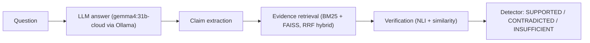

# Claim-Level Hallucination Detection — Progress Report

_Last updated: 2026-10-04 · Covers Stages 0–3 of [plan.md](../plan.md)_

## 1. Project Goal

Detect hallucinations in LLM answers at the **claim level**:



| Stage | Description | Status |
|---|---|---|
| 0 | Environment & project setup | ✅ Done |
| 1 | Datasets (FEVER, HaluEval) | ✅ Done |
| 2 | Oracle-evidence verification (upper bound) | ✅ Done |
| 3 | Retrieval + end-to-end 3-way FEVER | ✅ Done |
| 4 | Claim extraction with LLM (HaluEval) | ⏳ Next |
| 5 | Hybrid detector + Experiments 1–6 + ablation | ⏳ |
| 6 | Error analysis | ⏳ |
| 7 | FastAPI backend + React frontend | ⏳ |

---

## 2. Stage 0 — Environment & Setup

**Hardware:** RTX 4050 Laptop GPU (6 GB VRAM), Windows, PowerShell.

| Component | Choice | Notes |
|---|---|---|
| Python env | `.venv` in project root | torch 2.6.0 + cu124, CUDA verified |
| LLM | `gemma4:31b-cloud` via local Ollama (`http://localhost:11434`) | Cloud-routed → uses no local VRAM, needs internet |
| NLI model | `MoritzLaurer/DeBERTa-v3-base-mnli` | MNLI-only → **no FEVER leakage** |
| Embeddings | `BAAI/bge-small-en-v1.5` | 384-dim, normalised |
| Vector index | FAISS `IndexFlatIP` (exact) | |
| Config | [config.yaml](../config.yaml) | All paths, models, hyper-params, seed = 42 |

**Setup commands**
```powershell
python -m venv .venv
.\.venv\Scripts\Activate.ps1
pip install torch --index-url https://download.pytorch.org/whl/cu124
pip install -r requirements.txt
```

**Core utilities**
- [src/utils/config.py](../src/utils/config.py) — `load_config`, `resolve_path`, `set_seed`, `PROJECT_ROOT`.
- [src/generation/llm.py](../src/generation/llm.py) — `OllamaLLM` with `generate` / `generate_json`, **SQLite response cache** (`data/cache/llm_cache.sqlite`), retries with exponential backoff, and `parse_json_loose` (Gemma wraps JSON in ```` ```json ```` fences even in JSON mode).

> **Reproducibility note:** the cloud model can change server-side. The SQLite cache freezes outputs; the final report must record the model name and generation date.

---

## 3. Stage 1 — Datasets

Run: `python -m src.datasets.prepare --dataset all|fever|halueval`

### 3.1 Unified schema — [schema.py](../src/datasets/schema.py)

Every example is an `Example(id, source, question, answer, claims, context, label, binary_label, group, meta)`.

| Field | Meaning |
|---|---|
| `label` | 3-way claim label `SUPPORTED / CONTRADICTED / INSUFFICIENT`; `None` for HaluEval (no claim-level gold) |
| `binary_label` | `supported` / `hallucinated` (FEVER: NEI → hallucinated) |
| `group` | Examples sharing a group never cross splits (prevents leakage) |
| `context` | Gold evidence text |

### 3.2 FEVER — [fever.py](../src/datasets/fever.py)

- Source: official files from `fever.ai` (the HuggingFace loader is deprecated).
- `paper_dev` → train/val, `paper_test` → test; **label-balanced** sampling.
- `wiki-pages.zip` (1.7 GB) is **streamed in one pass** (~1m40s), never extracted. During the pass we collect gold pages + 50,000 random distractor pages.
- Fixed a `UnicodeDecodeError` while scanning (decode with `errors="replace"` + guarded `json.loads`).

| Split | Size | SUPPORTED | CONTRADICTED | INSUFFICIENT |
|---|---|---|---|---|
| train | 3000 | 1000 | 1000 | 1000 |
| val | 999 | 333 | 333 | 333 |
| test | 1998 | 666 | 666 | 666 |

**Retrieval corpus:** `data/processed/fever_corpus.jsonl` — 51,749 pages (1,749 gold + 50,000 distractors) = **247,848 sentences**. 24 gold pages were missing from the dump, so ~0.6% of verifiable claims have empty gold context; we accept this.

### 3.3 HaluEval QA — [halueval.py](../src/datasets/halueval.py)

- 2,000 questions → each gives 1 right + 1 hallucinated answer (same `group`).
- Group-aware 70/15/15 split ([splits.py](../src/datasets/splits.py)), binary-balanced.

| Split | Size |
|---|---|
| train | 2800 |
| val | 600 |
| test | 600 |

---

## 4. Stage 2 — Oracle-Evidence Verification (Upper Bound)

Run: `python -m src.evaluation.oracle_nli [--nli-model NAME]`
Code: [nli.py](../src/verification/nli.py), [similarity.py](../src/verification/similarity.py), [metrics.py](../src/evaluation/metrics.py), [oracle_nli.py](../src/evaluation/oracle_nli.py)
Output: `experiments/stage2_oracle/metrics_DeBERTa-v3-base-mnli.json`

**Setup:** verification with **gold** evidence (no retrieval errors). NLI premise = evidence, hypothesis = claim. Output probabilities always in order `[entail, neutral, contra]`.
- *NLI-concat*: all gold sentences joined into one premise.
- *NLI-max*: NLI per sentence, then max-aggregation (strongest entailment vs strongest contradiction).
- Thresholds are always tuned on **val** and reported on **test**.

### FEVER (verifiable claims only — NEI has no gold evidence)

| Method (test) | Accuracy | Macro-F1 |
|---|---|---|
| NLI-concat, 3-way argmax | 0.906 | 0.620* |
| NLI-concat, 2-way (S vs C) | **0.943** | **0.943** |
| NLI-max, 2-way | 0.940 | 0.940 |
| Similarity threshold, 2-way | 0.700 | 0.697 |

\*Low 3-way macro-F1 is an artefact: the gold set contains no INSUFFICIENT claims, so the occasional INSUFFICIENT prediction adds a zero-F1 class.

### HaluEval QA (premise = knowledge, hypothesis = question + answer; positive = hallucinated)

| Method (test) | Acc | P | R | F1 |
|---|---|---|---|---|
| NLI argmax | 0.587 | 0.572 | 0.690 | 0.625 |
| NLI entailment threshold | **0.708** | 0.791 | 0.567 | **0.660** |
| Similarity threshold | 0.500 | 0.500 | 1.000 | 0.667* |

\*Degenerate — flags everything as hallucinated. Right and hallucinated answers are equally on-topic, so similarity cannot separate them.

**Takeaways**
1. NLI with good evidence is strong on FEVER (~94%).
2. Similarity alone is a weak signal (70% FEVER, useless on HaluEval) — confirms plan §8.
3. HaluEval is harder: answers are judged as whole text; claim-level decomposition (Stage 4) should help.

---

## 5. Stage 3 — Retrieval + End-to-End 3-Way FEVER

Run: `python -m src.evaluation.fever_retrieval [--rebuild-index] [--nli-model NAME]`
Output: `experiments/stage3_retrieval/metrics_DeBERTa-v3-base-mnli.json`
Cache: `data/processed/indexes/` (BM25 + FAISS), `data/processed/retrieval/fever_{split}.jsonl` (top-20 hits per method + NLI probs for top-5 — reused by Stage 5).

### 5.1 Components — `src/retrieval/`

| File | What it does |
|---|---|
| [corpus.py](../src/retrieval/corpus.py) | Sentence-level unit `"<Title>: <sentence>"` keyed by `(page_id, sent_id)` |
| [bm25.py](../src/retrieval/bm25.py) | Custom vectorised Okapi BM25 on a scipy sparse matrix (k1=1.5, b=0.75). `rank_bm25` was too slow for 248k docs |
| [dense.py](../src/retrieval/dense.py) | bge-small embeddings (with bge query instruction) + exact FAISS inner-product |
| [hybrid.py](../src/retrieval/hybrid.py) | Reciprocal Rank Fusion (`rrf_k=60`) of BM25 top-50 + dense top-50; `Retriever` builds indexes once and caches them |

### 5.2 Retrieval quality (FEVER test, verifiable claims)

*Strict R@k* = a complete gold evidence set is in top-k · *hit@k* = at least one gold sentence in top-k

| Method | R@1 | R@5 | R@10 | R@20 | hit@5 | hit@20 |
|---|---|---|---|---|---|---|
| BM25 | 0.612 | 0.808 | 0.871 | 0.911 | 0.876 | 0.965 |
| Dense | **0.718** | **0.902** | **0.932** | **0.949** | **0.971** | 0.990 |
| Hybrid (RRF) | 0.679 | 0.886 | 0.917 | 0.948 | 0.950 | 0.990 |

### 5.3 End-to-end 3-way (all claims incl. NEI, top-5 evidence)

Pipeline: retrieve top-5 → NLI per sentence → max-aggregation → label by argmax or by tuned thresholds `(t_entail, t_contra)`.
*FEVER score* = label correct **and** (for verifiable claims) a full gold evidence set retrieved.

| Method / rule | Acc | Macro-F1 | FEVER score | Binary F1 |
|---|---|---|---|---|
| BM25 / argmax | 0.592 | 0.549 | 0.509 | 0.891 |
| BM25 / thresh | 0.621 | 0.606 | 0.546 | 0.891 |
| Dense / argmax | 0.613 | 0.559 | 0.568 | 0.901 |
| Dense / thresh | 0.638 | 0.612 | 0.595 | 0.900 |
| Hybrid / argmax | 0.626 | 0.582 | 0.571 | 0.902 |
| **Hybrid / thresh** | **0.652** | **0.633** | **0.600** | 0.901 |

**Takeaways**
1. **Dense beats hybrid on recall** — equal-weight RRF lets the weaker BM25 pull dense down. Weighted RRF is an ablation candidate.
2. **Hybrid still wins end-to-end** — BM25 adds lexically-matching sentences that help NLI.
3. **Tuned thresholds add ~5 macro-F1** over argmax.
4. **The bottleneck is verification, not retrieval** — retrieval finds gold evidence for ~95% of claims, yet accuracy drops from ~0.94 (oracle) to ~0.65. The hard part is separating INSUFFICIENT from CONTRADICTED.
5. Binary F1 (~0.90) is inflated because 2/3 of FEVER claims are "hallucinated"; macro-F1 is the main metric.

---

## 6. Key Design Decisions

| Decision | Reason |
|---|---|
| MNLI-only NLI model | Many `*-fever-anli` checkpoints were trained on FEVER → test leakage |
| Official FEVER files over HuggingFace | HF loading script deprecated |
| Stream the wiki zip | Avoids extracting 1.7 GB+ to disk |
| 50k distractor pages | Realistic but laptop-sized retrieval corpus |
| Group-aware HaluEval split | Right/hallucinated pairs of the same question must stay together |
| Logistic-regression combiner (Stage 5) instead of fixed 0.3/0.5/0.2 weights | Learned on val, more defensible |
| RRF for hybrid retrieval | No need to calibrate BM25 vs cosine score scales |
| Thresholds tuned on val only | Test set stays untouched |
| SQLite LLM cache | Cloud model may drift; caching freezes results and saves calls |

---

## 7. Project Layout (so far)

```
NLP_project/
├── config.yaml, requirements.txt, plan.md
├── data/
│   ├── raw/{fever,halueval}/        # downloaded source files
│   ├── processed/                   # fever_corpus.jsonl, indexes/, retrieval/
│   ├── splits/                      # {fever,halueval}_{train,val,test}.jsonl
│   └── cache/llm_cache.sqlite
├── experiments/
│   ├── stage2_oracle/metrics_*.json
│   └── stage3_retrieval/metrics_*.json
├── docs/PROGRESS.md                 # this file
└── src/
    ├── datasets/    schema, download, fever, halueval, splits, prepare
    ├── generation/  llm.py (Ollama client)
    ├── retrieval/   corpus, bm25, dense, hybrid
    ├── verification/ nli, similarity
    ├── evaluation/  metrics, oracle_nli, fever_retrieval
    └── utils/       config
```

## 8. Reproduce Everything

```powershell
.\.venv\Scripts\Activate.ps1
python -m src.datasets.prepare --dataset all      # Stage 1  (~3 min + downloads)
python -m src.evaluation.oracle_nli               # Stage 2  (~3 min)
python -m src.evaluation.fever_retrieval          # Stage 3  (~8 min first run, builds indexes)
```

> [!NOTE]
> PowerShell may report exit code 1 because HuggingFace/tqdm write to stderr. Check that the script prints `Saved -> ...` at the end.

## 9. Next Steps

1. **Stage 4** — Claim extraction from HaluEval answers with `gemma4:31b-cloud` (`generate_json`, cached); manually check ~50 outputs.
2. **Stage 5** — Hybrid detector: logistic regression on NLI probs, similarity, retrieval scores and evidence agreement; Experiments 1–6; ablation (incl. weighted RRF, dense-only, NLI-large); MLflow logging.
3. **Stage 6** — Error analysis using the 8 categories from the plan.
4. **Stage 7** — FastAPI (`/detect`, `/claims`, `/retrieve`, `/verify`, `/metrics`), then React UI.

**Open question:** project deadline — decides whether the React UI and extra datasets (TRUE / FELM / QAGS) stay in scope.
